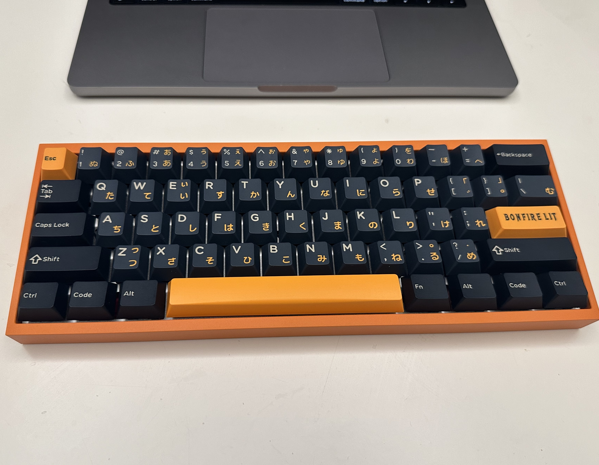

# rmk-ble-keyboard

An open source BLE/USB dual-mode GH60 keyboard using [Ebyte's E73 nRF52840 module](https://www.cdebyte.com/products/E73-2G4M08S1C), powered by [rmk](https://github.com/haobogu/rmk).



- Hardware: see root
- Firmware: see firmware folder
- Case: [KBDFans Tofu Redux](https://kbdfans.com/products/tofu60-redux-case)

## Flash firmware

To flash firmware to rmk-ble-keyboard, you should have a debug probe. There are two firmwares, `firmware/s140_nrf52_7.3.0_softdevice.hex` is the nRF's BLE stack, and `firmware/rmk-ble-keyboard.elf` is the keyboard firmware. You can follow the steps below to flash them to your keyboard:

0. Install [probe-rs](http://probe.rs/)
1. Erase your chip: 
    ```
    probe-rs erase --chip nrf52840_xxAA
    ```
2. Flash nRF softdevice
    ```
    probe-rs download --verify --format hex --chip nRF52840_xxAA firmware/s140_nrf52_7.3.0_softdevice.hex
    ```
3. Flash pre-compiled firmware
    ```
    # Flash pre-compiled firmware
    probe-rs download --verify --chip nRF52840_xxAA firmware/rmk-nrf52840.elf
    ```
    
4. Or, you can re-compile RMK keyboard firmware and flash(requires Rust, see [RMK's user guide](https://haobogu.github.io/rmk/setup_environment.html))
    ```
    # Compile and flash
    cd firmware/rmk-nrf52840
    cargo run --release
    ```